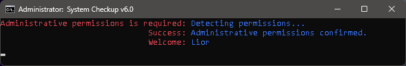
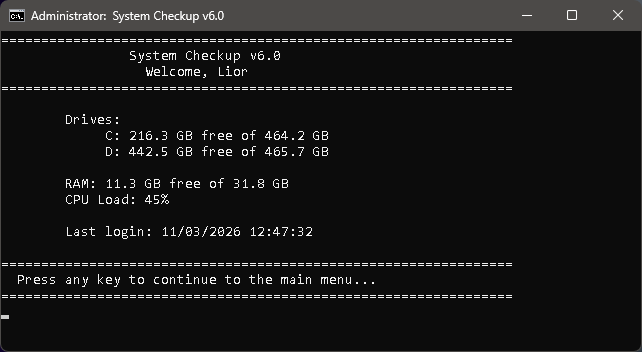
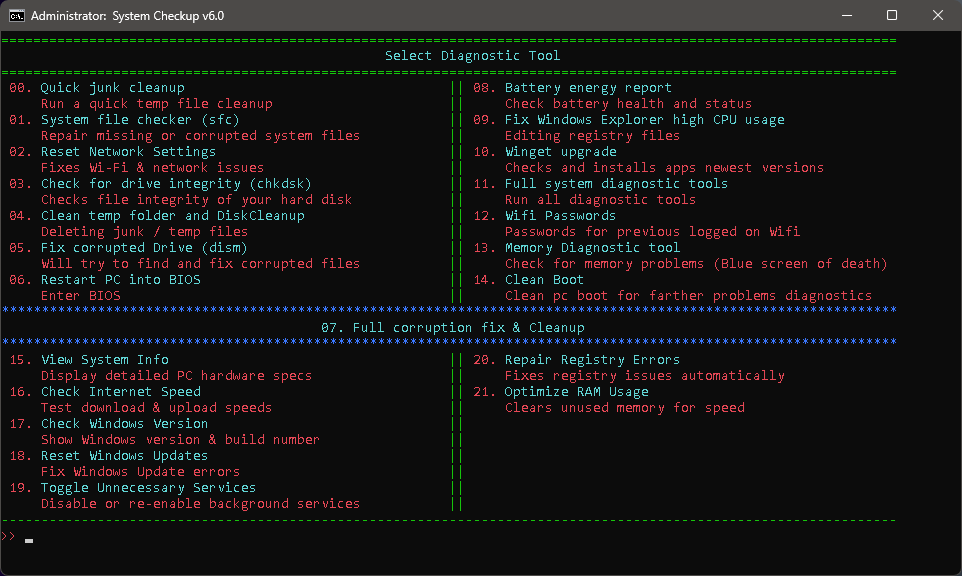
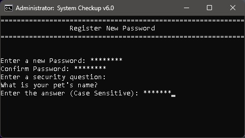
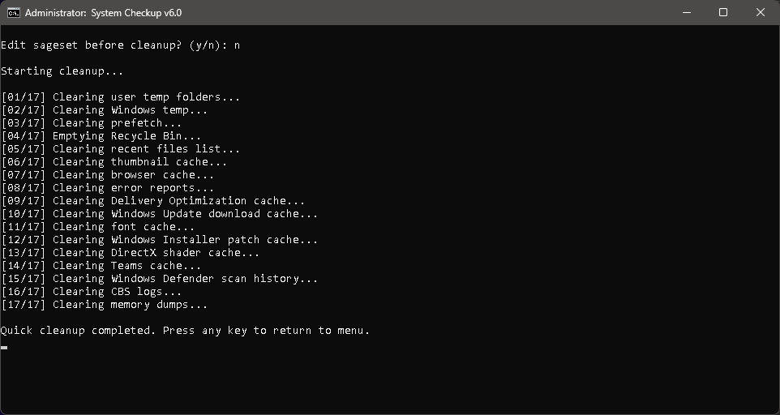
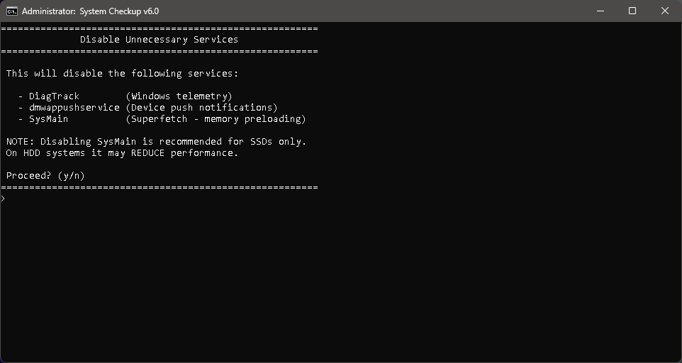

# SystemCheckup

A password-protected Windows diagnostic and maintenance toolkit built entirely in Batch/PowerShell. Developed and refined over 5 years, SystemCheckup provides a unified interface for the most common system repair and cleanup tasks - no third-party software required.

---

## Screenshots

**Permissions check & welcome**

**Startup summary - live system stats after login**

**Main menu**

**Registration - password and security question setup**

**Tool 00 - Quick Cleanup in progress**

**Tool 19 - Toggle Unnecessary Services**

---

## Features

- **Secure login system** - Salted SHA-256 password hashing, security question recovery, and persistent lockout after failed attempts
- **Startup summary** - Displays live system stats (CPU load, RAM, drive space, last login) immediately after login
- **22 diagnostic tools** covering cleanup, repair, diagnostics, network, and performance
- **Admin menu** - Manage restore points, view and clear the activity log, and change your password
- **Activity log** - Timestamped log file written to the Desktop after every tool run
- **Dual-drive support** - CHKDSK and full repair tools support both single and dual drive configurations
- **Auto-elevate** - Automatically relaunches as Administrator if permissions are insufficient

---

## Tools

| # | Tool | Description |
|---|------|-------------|
| 00 | Quick Cleanup | Deep temp file cleanup across system, user, and app directories |
| 01 | System File Checker | Runs `sfc /scannow` to repair corrupted system files |
| 02 | Network Reset | Full network stack reset - Winsock, IP, firewall, DNS |
| 03 | Drive Integrity Check | Runs `chkdsk` with full scan on one or two drives |
| 04 | Disk Cleanup | Clears temp folder and runs Windows Disk Cleanup |
| 05 | DISM Repair | Restores Windows image health via DISM |
| 06 | Restart to BIOS | Reboots directly into BIOS/UEFI firmware settings |
| 07 | Full Fix & Cleanup | Runs registry fix, winget upgrade, restore point, cleanup, SFC, DISM, CHKDSK, and restart |
| 08 | Battery & Energy Report | Generates and opens battery and energy reports |
| 09 | Explorer CPU Fix | Applies registry fix for Windows Explorer high CPU usage |
| 10 | Winget Upgrade | Updates all installed applications via winget |
| 11 | Full Diagnostic | Full repair suite without registry edit step |
| 12 | WiFi Passwords | Retrieves saved WiFi passwords by SSID |
| 13 | Memory Diagnostic | Launches Windows Memory Diagnostic tool |
| 14 | Clean Boot | Disables startup items and scheduled tasks for clean boot diagnostics |
| 15 | System Info | Displays OS, CPU, RAM, and GPU information |
| 16 | Internet Speed Test | Tests download speed, upload speed, and ping |
| 17 | Windows Version | Shows Windows version and build number |
| 18 | Reset Windows Update | Resets Windows Update services and cache folders |
| 19 | Toggle Services | Toggles SysMain and related services on/off |
| 20 | Registry Repair | Backs up and clears pending registry rename operations |
| 21 | RAM Optimizer | Raises Explorer process priority to free unused memory |

---

## Requirements

- Windows 10 or Windows 11
- PowerShell 5.1 or later (included with Windows 10/11)
- Must be run as Administrator (auto-elevate prompt included)
- `winget` required for tools 07 and 10 (pre-installed on Windows 11)

---

## Setup & Usage

1. Download `SystemCheckup.bat`
2. Right-click - **Run as administrator** (or let the script re-launch itself automatically)
3. On first run, you will be prompted to register a password and a security question
4. After login, a startup summary is displayed before the main menu
5. Enter the tool number and press Enter to run it

**Login prompt commands:**

| Command | Action |
|---------|--------|
| `help` | Show available commands |
| `reset_pass` | Reset password via security question |
| `exit` | Exit the program |

**Main menu commands:**

| Command | Action |
|---------|--------|
| `admin` | Open the admin menu (manage restore points, view log, change password) |
| `help` | Show available commands |
| `back` | Return to the login screen |
| `exit` | Exit the program |

**Data file:** Credentials are stored in `%APPDATA%\Microsoft\Windows\NlsData0414.bin` using salted SHA-256 hashes - the password itself is never stored in plain text.

**Log file:** An activity log is maintained at `%USERPROFILE%\Desktop\SystemCheckup_Log.txt`

---

## Version History

| Version | Highlights |
|---------|------------|
| v6.0 | Complete code overhaul. Subroutine architecture, startup summary screen, admin menu, salted SHA-256 hashing, persistent lockout, timestamped log file, removed all `wmic` calls in favour of PowerShell, standardized console across all tools |
| v5.0 | SHA-256 password hashing, security question recovery, failed attempts lockout, network reset expanded, 9 new tools added (System Info, Speed Test, Windows Version, Reset Windows Update, Registry Repair, RAM Optimizer, Service disabler) |
| v3.4.7 | Auto-restart as Administrator, replaced `ping` delays with `timeout`, added `restore_p_del` command, fixed WiFi SSID error handling, added Memory Diagnostic (13) and Clean Boot (14) |
| v3.4.5 | NVIDIA and app-specific cache paths added to cleanup, dual-drive CHKDSK, sageset confirmation prompt, improved menu input validation |
| v3.3.1 | Initial release. Core tools: SFC, DISM, CHKDSK, DNS flush, Disk Cleanup, BIOS restart, battery report, Explorer CPU fix, Winget upgrade, full fix (tool 07) |

---

## Disclaimer

This tool performs low-level system operations including file deletion, registry modification, service configuration, and system restarts. **Use it at your own risk.**

By using SystemCheckup, you acknowledge and agree that:

- You are solely responsible for any outcomes resulting from running this script on your system
- The author provides no guarantees of fitness for any particular purpose or environment
- No liability is accepted for data loss, system instability, or any other damage - direct or indirect - caused by the use or misuse of this tool
- It is strongly recommended to **create a system restore point** before running any repair or cleanup tool (tools 07 and 11 do this automatically)

This script is provided as-is, for personal and educational use.

---

## License

MIT License

Copyright (c) 2026

Permission is hereby granted, free of charge, to any person obtaining a copy
of this software and associated documentation files (the "Software"), to deal
in the Software without restriction, including without limitation the rights
to use, copy, modify, merge, publish, distribute, sublicense, and/or sell
copies of the Software, and to permit persons to whom the Software is
furnished to do so, subject to the following conditions:

The above copyright notice and this permission notice shall be included in all
copies or substantial portions of the Software.

THE SOFTWARE IS PROVIDED "AS IS", WITHOUT WARRANTY OF ANY KIND, EXPRESS OR
IMPLIED, INCLUDING BUT NOT LIMITED TO THE WARRANTIES OF MERCHANTABILITY,
FITNESS FOR A PARTICULAR PURPOSE AND NONINFRINGEMENT. IN NO EVENT SHALL THE
AUTHORS OR COPYRIGHT HOLDERS BE LIABLE FOR ANY CLAIM, DAMAGES OR OTHER
LIABILITY, WHETHER IN AN ACTION OF CONTRACT, TORT OR OTHERWISE, ARISING FROM,
OUT OF OR IN CONNECTION WITH THE SOFTWARE OR THE USE OR OTHER DEALINGS IN THE
SOFTWARE.
